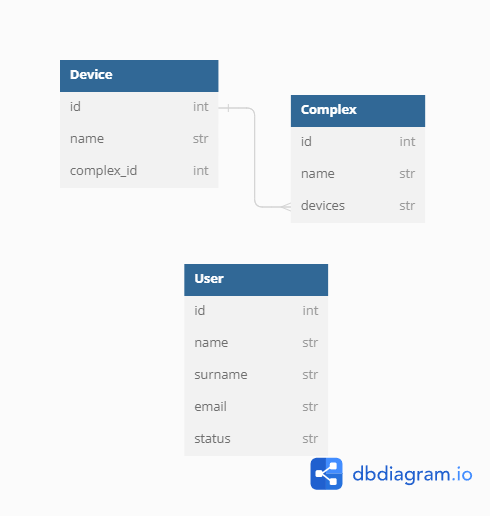

# MSU_aerosol_site

[](https://github.com/omixyy/MSU_aerosol_site/actions/workflows/python-package.yml)

Сайт делался специально под нужды Географического Факультета МГУ имени М.В. Ломоносова. Он представляет собой систему, разработанную на Flask и bootstrap, реализующую систему работы с графиками, регистрацию и работу с базами данных для хранения приборов и комплексов.

## *Инструкция к локальному запуску*

1) Склонировать репозиторий или скачать zip архив

    ```bash
    git clone https://github.com/omixyy/MSU_aerosol_site
    ```

2) Создать виртуальное окружение

    ```bash
    python -m venv venv
    ```

3) Установить зависимости

    - Для продакшна

        ```bash
        pip install -r requirements/prod.txt
        ```

    - Для тестирования

        ```bash
        pip install -r requirements/test.txt
        ```

    - Для разработки

        ```bash
        pip install -r requirements/dev.txt
        ```

4) Перейти в основную папку проекта: msu_aerosol

    ```bash
    cd lyceum
    ```

5) Запустить сайт

    ```bash
    python run.py
    ```

## *Про переменные окружения*

В корне проекта можно найти файл .env.example. Он нужен для того, чтобы показать, какие настройки могут быть переданы в проект через файл .env. Если быть конкретнее, то ниже представлена информация по каждой необходимой для работы сайта переменной.

|Переменная|Принимаемые значения|
|-|-|
|SECRET_KEY|Строка|
|DATABASE_URI|URI базы данных|

## *Админка*

Администратор на админской странице может:

1) Изменять уже существующие записи
2) Создавать новые
3) Изменять статусы пользователей

## *База данных*

Ниже представлена ER-диаграмма базы данных

